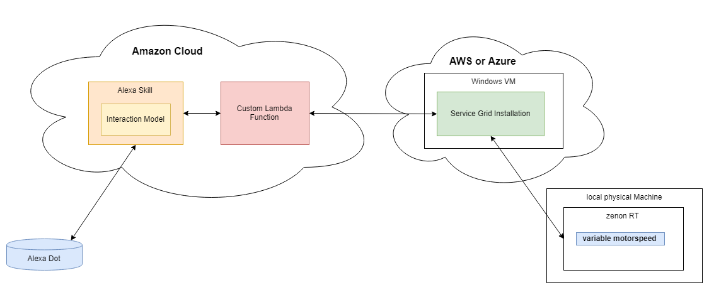

# Alexa Service Grid Demo
A demo showing the use of Alexa voice commands to interact with zenon variables.


## General
The following document describes the necessary steps to setup an Alexa skill, which allows users to manipulate zenon variables with the help of voice commands.
The general functionality allows users to:
- set variable values of zenon variables
- request the current values of zenon variables
- increase the values of zenon variables by a given offset
- decrease the values of zenon variables by a given offset
- reset the values of zenon variables


## Technical and architectural overview

The architecture of the demo consists out of the following components:
- Amazon Echo Dot
- Alexa Skill
- Amazon Lambda Function
- publicly accessible virtual machine, with Service Grid installed
- local machine with zenon installed

An Alexa Skill represents a set of functionalities, which can be consumed via voice commands. Those voice commands are interpreted by the Alexa voice recognition services based on the definition of the Skill's interaction model. As a consequence, those requests can trigger so called lambda functions, which can be written in JavaScript and are used for further request processing.
In terms of this demo, the lambda function is defined to make use of the Service Grid API component, to trigger variable changes on the zenon RT and the respective RT project.

The following image shows the architecture overview of this demo:



## Requirements

The following requirements must be met to setup the demo:
- Alexa Developer Account\
  Can be created [here](https://developer.amazon.com/en/alexa-skills-kit)
- Amazon Echo Dot, which is successfully setup and linked to the Alexa Developer Account
- Publicly accessible Virtual Machine
    - Windows operating system (at least Windows 8.1 or Windows Server 2012)
    - hosted on AWS, Azure or any other cloud provider
    - Service Grid installation and configuration done (all Service Grid Services need to be installed to that specific machine)
    - Service Grid ports 9400, 9410, 9411, 9430 and port 443 opened for external accessibility
    - All services make use of a valid X509 certificate for TLS encryption\
    To create a valid certificate make use of the [Let's Encrypt](https://letsencrypt.org/) service and the tool [Certify the web](https://certifytheweb.com/).
    - The virtual machine must be accessible via a dedicated domain or a static public IP address.
- additional virtual or physical machine with zenon >= 8.10 Build 59866 installed


# Configuration of Service Grid and zenon

For the further configuration of Service Grid the following assumptions are made:
* Service Grid is already installed to the public accessible virtual machine
* All services are configured to have valid certificate bundles and can access the Data Hub
* The requirements listed in the previous section are met

For more information on the setup and configuration of Service Grid, please refer to the Service Grid manual.

## Configuration of desired authentication source for Identity Service

To allow users to authenticate with the Service Grid API component, it is necessary to configure the desired authentication source for the Identity Service.
* This is done with the help of the Configuration Backend.
* The easiest way is using the zenon RT authentication source, but also all other authentication sources may be used.

For information on configuring the authentication source for the Identity Service, please refer to the Service Grid manual.

## Link zenon with Service Grid installation

To be able to modify zenon variables, it is required to link the zenon RT with the Service Grid installation.
* This is done using the Service Node Configuration Tool on the physical zenon machine with the zenon installation.\
The way how this is done is outlined in the Service Grid manual.

**Attention:** In order to include the correct domain name of the Service Hub within the Certificate Bundles, the user must perform the following actions:
* change the configuration field **"Url of Data Hub"** within the Hub Controller's settings page to the **domain name** of the Service Grid VM
* Save and download the updated configuration *CDDataHub.conf*
* Manually place the file into the Data Hub's configuration folder *%CD_SYSTEM/ServiceGrid/DataHub* on the Service Grid VM.\
Replace the original configuration file with the new one.

**Important:** When requesting the certificate bundle from the physical zenon machine the Service Node Configuration Tool may report a warning that the remote certificate is not trusted. Only continue by clicking *Yes* if you are absolutely sure that the presented certificate belongs to the remote VM and you are not the victim of a man-in-the-middle attack. 


## Configure the zenon project

To be able to use a zenon project together with the Alexa skill the following steps need to be performed:

1. Create a new zenon project or use an existing one
2. Import the Service Grid RT Addin to the zenon Project\
The Addin can be found in the following place "C:\ProgramData\COPA-DATA\zenon810\ServiceGrid\CopaData.ServiceGrid.Runtime.Client.scadaAddIn" of your zenon 8.10 installation.
3. Add a file called "serverConfig.xml" with the following content to the zenon project. (Project > Files > Others)
```
<?xml version="1.0"?>
    <ServerConfig>
    <ReadUsers Value="1"/>
</ServerConfig>
```

4. Add the following three variables to the project:

    | Name | Driver | Type | Property: Service Grid access permission |
    | - | - | - | - |
    | Alexa_motorspeed | Intern Driver | INT | Read-write |
    | Alexa_abc | Intern Driver | BOOL | Read-write |
    | Alexa_message | Intern Driver | STRING | Read-write |

5. Configure a zenon Screen with numeric and text elements to show the respective variable values in the Runtime
6. Create a zenon function of type "Display dialog 'Manage Runtime services'" and create a button for it
7. Compile the project and start the RT

8. Once the project is compiled and the RT is started, make sure to open the *Manage Runtime services* dialog and start the Service Addin called *ServiceGrid-Connector*.\
Note: It is also possible to set the start type of the service to *automatically* using this dialog.


## Configure user groups and verify data access

Once the zenon RT project and the Service Addin are started, the zenon RT connects to the Service Grid installation and publishes project information about available variables, alarms, events and archives.

To allow users to access this information, it is required to assign them the respective access permissions with the help of the Configuration Backend.
1. Therefore login to the Configuration Backend
2. Add the new project to an existing user group or import a new user group to link the project to it.
3. Make sure to assign at least the permissions *ReadAll* and *WriteVariables* to that user group.
4. Verify that the configuration is correct by trying to request and set variable values via the Service Grid API's Swagger documentation.

For more information on how to configure user groups and permissions, please refer to the respective section in the Service Grid manual.
For information on how to use the Service Grid API, please refer to the Service Grid manual or the Swagger API documentation.


# Creation and Configuration of Alexa Skill

Alexa Skills allow users to interact with other services via voice commands.
In terms of this demo, the used Alexa Skill allows to manipulate a single zenon variable.

## Create new Alexa Skill and restore interaction model

To create a new Alexa Skill and restore the provided interaction model, perform the following steps:
1. Login to the Alexa Developer Console
2. Create a new Skill
    - choose a name (e.g. "motor control")
    - set *default language* to *English (US)*
    - choose *Custom* for the model type
    - choose *Alexa-Hosted (Node.js)* as hosting method
    - Create the skill by hitting *Create Skill*
4. Once the Skill was successfully created, open the *JSON Editor* from the left menu
5. Copy and paste the content of the attached file *alexa-interaction-model.json* into the *JSON Editor* and save the model using the button *Save Model*\
This will restore the interaction model and therefore all predefined voice commands for this demo.

## Restore the code of the lambda function

The definition of actions, which are triggered by the aforementioned voice commands is done with the help of so-called Lambda functions. Those are functions written in JavaScript, which are hosted either within the Alexa Developer Console or on Amazon Web Services.\
In this case the Lambda function is hosted in Alexa, which was defined during the creation of the skill.

To restore the lambda function's code perform the following steps:
1. Open the *Code* menu from the top menu
2. Select the source code file *index.js* within the folder view on the left
3. Copy the content of the attached file *index.js* and replace the content of the skill's *index.js*
4. **Attention:** Replace the values for the variables *dataSourceId* and *serviceGridApiUrl*, situated in the top of the file, with the respective Project GUID and the Service Grid VM's domain name.
5. Click on *Save* to save the changes
6. Click on *Deploy* to activate the skill's lambda function


## Activate Account-Linking for the Alexa Skill

In order to use the Service Grid API and perform API calls, it is required to authenticate against the Identity Service beforehand. When performing requests via the Service Grid API's Swagger Documentation, the user is automatically forwarded to the login page when hitting the *Authorize* button in the top right corner.\
The Authentication protocol, which is used is OAuth2, which is also supported for Alexa Skills. In terms of Alexa Skills this process of configuring the user authentication mechanism is known as *Account-Linking*.\
For further information on Alexa's account linking, please refer to the respective Amazon documentation: https://developer.amazon.com/de/docs/account-linking/understand-account-linking.html


To successfully activate Account-Linking with Service Grid Identity Service, follow the subsequent sections.

### Configuration of Alexa Skill
1. Open the Skill's *Account-Linking* menu
2. Activate Account-Linking by activating the slider "Do you allow users to create an account or link to an existing account with you?"
3. Activate "Allow users to enable skill without account linking (Recommended)."
4. Let "Allow users to link their account to your skill from within your application or website" unchecked
5. Choose "Auth Code Grant" for Option "Security Provider Information"
6. Fill the form with the following values:

    | Field | Value |
    | - | - |
    | Authorization URI | https://\<domain of Service Grid VM\>/connect/authorize |
    | Access Token URI | https://\<domain of Service Grid VM\>/connect/token |
    | Your Client ID | alexa-skill |
    | Your Secret | paste the client secret which is generated from the Configuration Backend within the section **Configuration in Configuration Backend** |
    | Your Authentication Scheme | Credentials in request body |
    | Scopes | openid <br/> profile <br/> API <br/> email <br/> offline_access |
    | Domain List | - |
    | Default Access Token Expiration Time | - |
    | Alexa Redirect URLs | those predefined URLs are specific to the Alexa skill and need to be configured for the client in the Configuration Backend |
7. Save the settings by clicking *Save*


### Configuration in Configuration Backend
1. Open the Configuration Backend on the Service Grid VM
2. Switch to the Clients menu and create a new client with the following parameters:

    | Field | Value |
    | - | - |
    | Application ID | alexa-skill |
    | Application name | alexa-skill |
    | Redirect URIs | paste the predefined Alexa Redirect URLs from the Alexa skill configuration |
    | Allowed scopes | openid <br/> profile <br/> API <br/> email <br/> offline_access |
    | Grant types | Code |
    | Secret | copy the generated value and paste it to the field 'Your Secret' within the Alexa skill configuration |
    | Allow access tokens via browser | checked |
3. Save the settings by clicking *Save*


### Change Identity Service to listen on port 443

Amazon requires that Authentication Providers, which are used by Alexa Skills for Account-Linking, must be accessible on port 443. Therefore the Identity Service's configuration needs to be adapted to listen on that respective port.

To change the configuration follow the subsequent steps:
1. Stop the Identity Service via the Task Manager's Services tab
2. Open the file *%CD_SYSTEM%\ServiceGrid\IdentityService.json* with the help of a text editor
3. Adapt the content the following way:
    ``` json
    {
        "MqttClientConfig": {
            <do not modify this content>
        },
        "HostingDomainName": "<domain of Service Grid VM>",
        "Kestrel": {
            "Certificates": {
                "Default": {
                    "Path":"<path to valid X509 certificate for HTTPS encryption>.pfx",
                    "Password":"<password of X509 certificate>"
                }
            },
            "EndPoints": {
                "Https": {
                    "Url": "https://*:443"
                }
            }
        }
    }
    ```
4. Save the file and restart the Identity Service
5. Also make sure to restart the Service Grid API
6. Validate the change and try to authenticate at the Service Grid API and request data.

**Note:** If the user authentication (login) at the Service Grid API does not work anymore, it might be necessary to perform a logout and login via the Identity Service's Web UI.


### Link the Account with the Alexa Skill 

After the above steps, the Account-Linking of the Alexa Skill is prepared and can be done via the following steps:
1. Login to alexa.amazon.com or open the Alexa smartphone App
2. Navigate to the settings page of the newly created Alexa Skill
3. Trigger and perform the account linking\
Thereby it is necessary to authenticate at the Identity Service
4. If the account linking was successful, you are told so by a respective message.

Note: The case of an error during the account linking, please see the **Troubleshooting** section.


# Test the functionality

Testing the functionality of the Alexa Skill is either possible within the Alexa Developer Console, or via a real Amazon Echo Dot.
Make sure that the Skill is enabled for the respective Alexa user account and the Amazon Dot is registered to the same Alexa user, the Skill is created by.
Also take care of a successful account-linking, which is necessary for the Service Grid API, to accept any requests sent from the Alexa Skill.
Furthermore the zenon Runtime with the respective zenon Project must be started.


## Phrases that can be used

Here is a list of available actions and phrases:

| Action | Sample phrases |
| - | - |
| List small help | "What can I do?" |
| List comprehensive help | "Please tell me all available actions." <br/> "List all available actions." |
| Get the current value of a variable | "What's the value of variable {variable name}?" <br/> "Tell me the value of {variable name}." |
| Set the value of a variable | "Set {variable name} to value {variable value}." <br/> "Modify {variable name} to {variable value}." <br/> "Change {variable name} to value {variable value}." |
| Increase the value of a variable by a certain offset | "Increase the value of {variable name} by {offset}. <br/> "Increase {variable name} by {offset}." |
| Decrease the value of variable by a certain offset | "Decrease the value of {variable name} by {offset}. <br/> "Decrease {variable name} by {offset}." |
| Rest the value of a certain variable | "Reset the value of {variable name}." <br/> "Reset variable {variable name}." <br/> "Reset {variable name}." |


If Alexa does not recognize particular elements of the commands, it will prompt the user for providing the missing information.\
When Alexa has successfully understood the command and all necessary information is provided, it will repeat the command and asks the user for a confirmation before executing it.


# Further information and links

## Modifying the project
If additional zenon variables shall be accessible via Service Grid API or the Alexa Skill, make sure to set the Service Grid Access Permissions using the zenon Editor to an appropriate value.

## Adding additional variables to be recognized by Alexa
If additional variable names shall be recognized by the Alexa Skill, add those variable names to the skill's slot type *CUSTOM_variableName*.
Otherwise Alexa does not reconize the spoken variable name as a valid input.


# Troubleshooting

## Alexa Skill tells me to link my account
**Solution:** Make sure to do the account linking via alexa.amazon.com or via the Alexa smartphone app and that it successfully completes.

## Account Linking cannot be established
**Solution:** Ensure that ...
* ... the Identity Service HTTPS endpoint uses a valid and trusted X509 certificate
* ... the Identity Service is listening on port 443 of the Service Grid VM
* ... user authentication for Service Grid API is working successfully
* ... the client configuration within the Configuration Backend and the Alexa Skill is done correctly
* ... the usage of refresh tokens is activated for the Alexa client using MongoDB Compass

## Alex Skill reacts with: "It seems that I could not find the variable you are looking for."
**Solution:** Take care that ...
* ... the variable name is recognized correctly by Alexa
* ... the variable is available via the Service Grid API
* ... the Service Grid Access Permissions for that variable are set correctly
* ... the Project Id corresponds to the value of *dataSourceId* within the skill's lambda code

## Alexa Skill reacts with: "It seems that you do not have the necessary permissions to perform this action."
**Solution:** Assign the correct permissions to the user group and the project using the Configuration Backend.

## Alexa Skill reacts with: "It seems that the respective backend service is offline"
**Solution:** The zenon RT must be started and must use the correct zenon Project.

## Alexa Skill reacts with: "It seems that the backend API is not licensed"
**Solution:** The Service Grid API needs to have a valid license to work properly.\
Obtain a valid license for the Service Grid installation.

## Alexa Skill reacts with: "Internal problem" or "Error with HTTP request"
**Solution:** See the log files of the skill's lambda function for further information.\
Also check the logs of the Service Grid API using zenon Diagnosis Viewer.

## New variable names are not recognized by Alexa
**Solution:** Ensure that those variable names are added to the skill's slot type *CUSTOM_variableName*.


